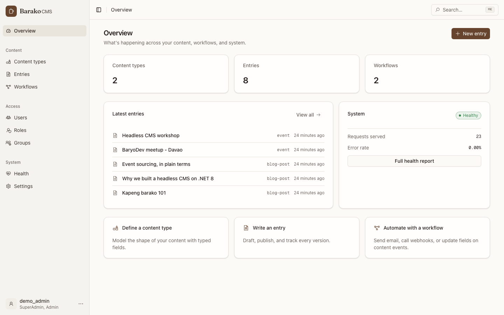
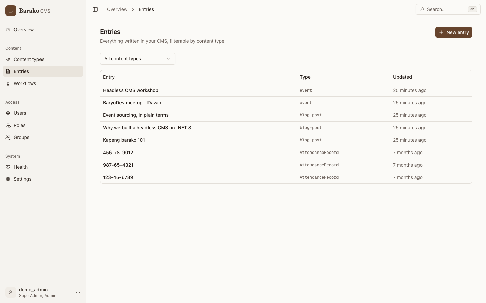
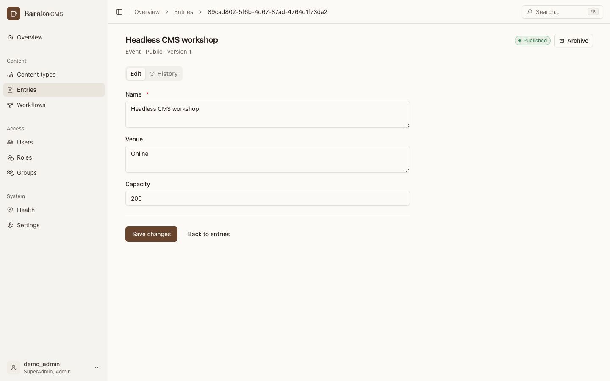
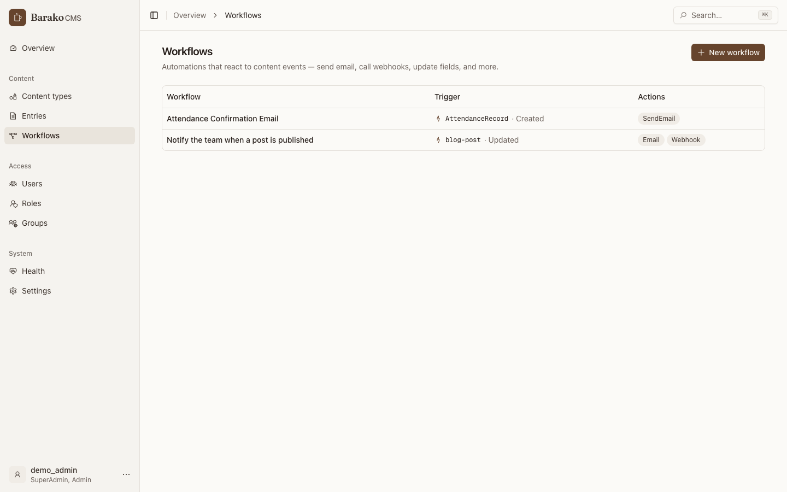
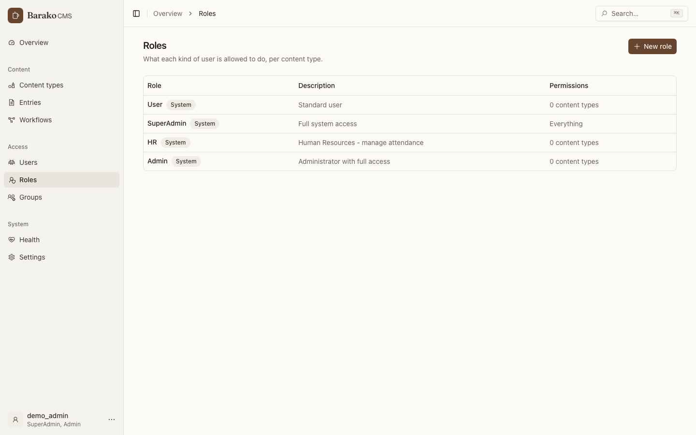
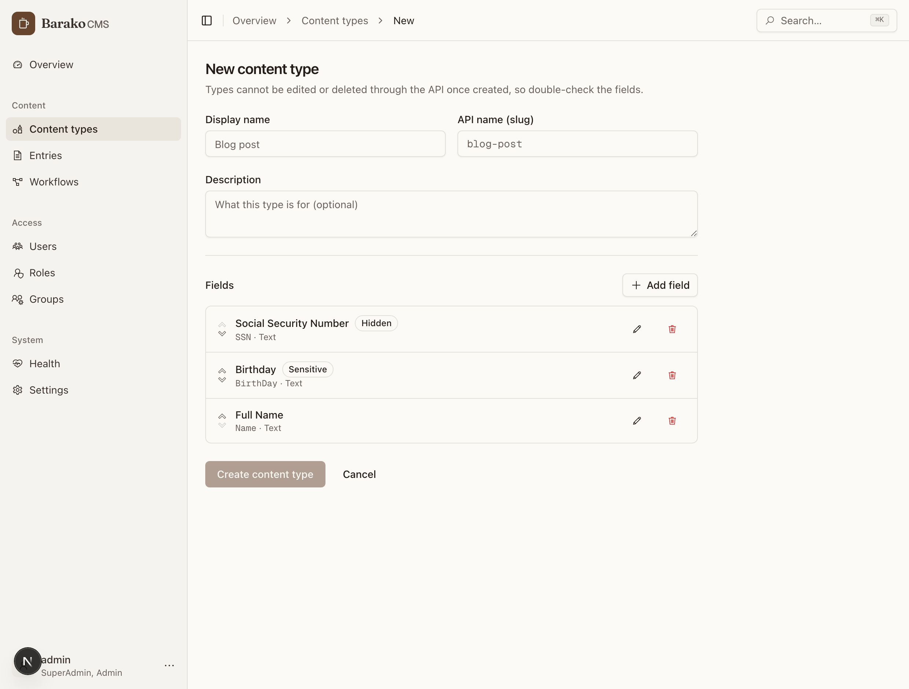

# barakoBrew

The console for [barakoCMS](https://github.com/BaryoDev/barakoCMS). barakoCMS is the API, and the
only surface it ships with is Swagger. barakoBrew is where you design content types, roles,
workflows and integrations against that API. It is published as `ghcr.io/baryodev/barako-admin`.

**Live demo: <https://playground.baryo.dev/barakocms>**, sign in as `demo_admin` / `BarakoDemo2026!`



## Run it against an API

The image needs no build step. Point it at a running barakoCMS:

```bash
docker run -p 3000:3000 \
  -e NEXT_PUBLIC_API_URL=http://localhost:5005 \
  ghcr.io/baryodev/barako-admin:latest
```

Open <http://localhost:3000> and sign in with the initial admin account (`InitialAdmin__Username` /
`InitialAdmin__Password` on the API). The API has to allow the console's origin, so set
`CORS__AllowedOrigins=http://localhost:3000` on it.

No API yet? [`quickstart/`](quickstart/) composes Postgres, the API and the console from published
images.

`NEXT_PUBLIC_API_URL` is read at container start by `entrypoint.sh`, which writes
`public/env-config.js`. Repointing the console at another API never needs a rebuild.

Tags on `ghcr.io/baryodev/barako-admin`:

| Tag | Built from |
| --- | --- |
| `latest`, `<version>` | a `v*` tag, linux/amd64 and linux/arm64 |
| `dev`, `dev-<sha>` | every merge to master, both architectures |
| `playground`, `playground-<version>` | the base-path build that runs playground.baryo.dev, arm64 |

### Serving under a sub-path

To host the console at something like `example.com/barakocms`, bake the base path in at build
time (Next.js resolves `basePath` during the build):

```bash
docker build --build-arg NEXT_BASE_PATH=/barakocms -t barako-admin:subpath .
```

Then proxy `/barakocms/` to the container. Next.js 308-redirects `/barakocms/` to `/barakocms`, so
an nginx rule redirecting the other way will loop. Proxy the bare path instead of redirecting it.

## What it covers

| Area | Capabilities |
| --- | --- |
| Overview | Live stats, latest entries, health summary, quick actions, command palette |
| Content types | Browse and define schemas with the API's typed fields |
| Entries | Create, edit, publish, archive, filter by type, paginate, version history with rollback |
| Workflows | Trigger builder, conditions, actions (Email, SMS, Webhook, CreateTask, UpdateField, Conditional), template variables, validation, dry run, execution logs and runs |
| Connectors | Outbound requests and the connectors screen |
| Users | Assign and remove roles and groups inline |
| Roles | Full CRUD with a per-content-type Create/Read/Update/Delete permission matrix |
| Groups | Full CRUD plus member management |
| Settings | Runtime toggles grouped by category, devices, portability |
| Health | Live health checks, API metrics, Kubernetes status |

Sessions ride the API's rotating refresh tokens: the 15-minute access token renews automatically,
and a single in-flight refresh is shared across concurrent requests so the backend's replay
detection is never tripped. The access token lives in memory, not in local storage.

## Screenshots

| Entries | Entry editor and version history |
| --- | --- |
|  |  |

| Workflows | Role permissions |
| --- | --- |
|  |  |

| Health | Per-field sensitivity |
| --- | --- |
|  |  |

## Stack

- **Next.js 16** (App Router, React 19, standalone output)
- **shadcn/ui** on Tailwind CSS v4. Every colour flows through theme tokens in
  `src/app/globals.css`. The theme is Signal: indigo on a near-white page, Sora for display and
  Manrope for body, 14px panels. Light only, pinned in `src/app/layout.tsx`, because a Signal dark
  palette has not been drawn
- **Icons**: [Line Awesome by Icons8](https://icons8.com/line-awesome), vendored as inline-SVG
  React components in `src/components/icons/` (regenerate with `node scripts/gen-icons.mjs`)
- **TanStack Query** for data, **axios** with auth and refresh interceptors (`src/lib/api.ts`)
- **sonner** toasts, **next-themes**, and a command palette

## Local development

```bash
npm install
npm run dev        # http://localhost:3000, expects the API on http://localhost:5006
```

```bash
npm run lint       # eslint, with the jsx-a11y rules on
npx tsc --noEmit   # types
npm test           # vitest
npm run test:e2e   # playwright against a mocked API
npm run build      # production build
```

The mocked end-to-end pack in `e2e/` proves the console behaves given fixtures. It cannot prove the
fixtures match the server, so `smoke/` is the unmocked pack: `scripts/smoke-check.sh` stands up
Postgres and the published API image in Docker, seeds an administrator and an entry, builds the
console against them and runs `smoke/`. It contains no `page.route` and the script refuses to run
if one appears. CI runs it on every pull request and nightly, so an API change surfaces here
without anyone pushing.

## Layout

```
src/
  app/(admin)/          # authenticated pages inside the sidebar shell
  app/login/            # sign-in
  components/ui/        # shadcn/ui primitives
  components/icons/     # generated Icons8 Line Awesome SVGs
  components/patterns/  # PageHeader, EmptyState, StatusBadge, ConfirmDialog, pagination
  hooks/                # TanStack Query hooks per feature area
  lib/api.ts            # axios client, token store, refresh rotation, pagination types
  types/                # API models mirroring the backend
e2e/                    # Playwright, mocked API
smoke/                  # Playwright, real API
quickstart/             # docker compose for Postgres + API + console
```

## Contributing

Read [CONTRIBUTING.md](CONTRIBUTING.md) first; the coding standard is [AGENTS.md](AGENTS.md).
Opening a pull request means you agree to the [contributor terms](CLA.md). Licensed under the
[Mozilla Public License 2.0](LICENSE).

If barakoCMS is useful to you, a star on the [API repository](https://github.com/BaryoDev/barakoCMS)
helps other people find it.
